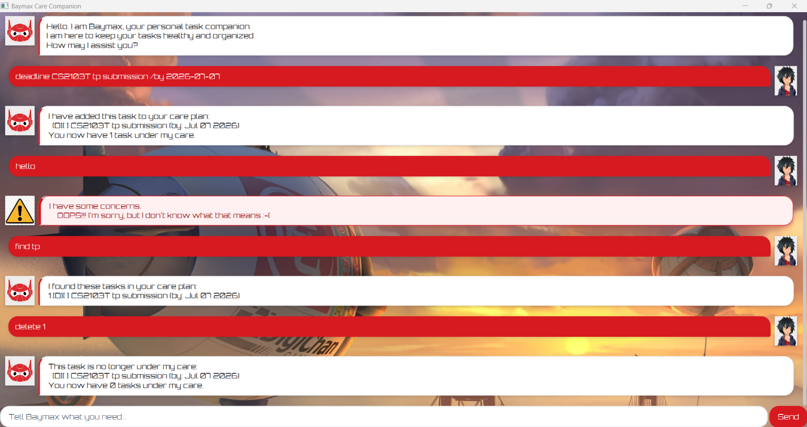

# Baymax User Guide

Baymax is a desktop task companion that helps you record, find, complete, and remove tasks through a chat-style interface. It supports todos, deadlines, and multi-day events, and saves your care plan between sessions.



Image credits: the warning image is from [Pngtree](https://pngtree.com/), the background painting is from [WallpaperFlare](https://www.wallpaperflare.com/), and the Hiro Hamada and Baymax images are from [HiClipart](https://www.hiclipart.com/).

## Quick start

1. Install Java 25.
2. Open a terminal in the project folder.
3. On Windows, run `gradlew.bat run`. On macOS or Linux, run `./gradlew run`.
4. Type a command in the input box and press <kbd>Enter</kbd>, or select **Send**.

If you have built the application with `gradlew.bat shadowJar` or `./gradlew shadowJar`, you can instead start the packaged application with:

```text
java -jar build/libs/baymax.jar
```

Baymax loads saved tasks from `data/Baymax.txt`. The file and its parent folder are created automatically when they do not exist.

## Command overview

| Action | Format |
| --- | --- |
| Add a todo | `todo DESCRIPTION` |
| Add a deadline | `deadline DESCRIPTION /by YYYY-MM-DD` |
| Add an event | `event DESCRIPTION /from YYYY-MM-DD /to YYYY-MM-DD` |
| List all tasks | `list` |
| Find tasks | `find KEYWORD [MORE_KEYWORDS]` |
| Mark a task as complete | `mark TASK_NUMBER` |
| Mark a task as incomplete | `unmark TASK_NUMBER` |
| Delete a task | `delete TASK_NUMBER` |
| Save and finish | `bye` |

Commands are lowercase. Baymax accepts extra spaces or tabs between command parts and removes leading and trailing whitespace.

## Understanding the task list

Baymax displays a letter for the task type and a completion marker for its status:

- `[T]` is a todo.
- `[D]` is a deadline.
- `[E]` is an event.
- `[ ]` means the task is incomplete.
- `[X]` means the task is complete.

For example:

```text
1.[T][ ] buy groceries
2.[D][X] submit report (by: Sep 30 2026)
3.[E][ ] project retreat (from: Oct 10 2026 to: Oct 12 2026)
```

Use the number shown beside a task with `mark`, `unmark`, or `delete`. Task numbers can change after a task is deleted, so use `list` again when unsure.

## Adding a todo: `todo`

Adds a task without a date.

Format: `todo DESCRIPTION`

Example:

```text
todo buy groceries
```

Baymax adds the task as an incomplete todo: `[T][ ] buy groceries`.

## Adding a deadline: `deadline`

Adds a task that must be completed by a particular date.

Format: `deadline DESCRIPTION /by YYYY-MM-DD`

Example:

```text
deadline submit report /by 2026-09-30
```

Baymax displays the task as `[D][ ] submit report (by: Sep 30 2026)`.

Use `/by` exactly once. The date must be a real calendar date in `yyyy-MM-dd` format, with a year from `0001` to `9999`.

## Adding an event: `event`

Adds a task that takes place over a date range.

Format: `event DESCRIPTION /from YYYY-MM-DD /to YYYY-MM-DD`

Example:

```text
event project retreat /from 2026-10-10 /to 2026-10-12
```

Baymax displays the task as `[E][ ] project retreat (from: Oct 10 2026 to: Oct 12 2026)`.

Use `/from` and `/to` exactly once and in that order. Both dates follow the same rules as deadline dates, and the end date must be later than the start date.

## Listing tasks: `list`

Displays every task in the order in which it was added.

Format: `list`

Example output:

```text
Here is your current care plan:
1.[T][ ] buy groceries
2.[D][ ] submit report (by: Sep 30 2026)
```

If no tasks exist, Baymax displays the heading with an empty list.

## Finding tasks: `find`

Finds tasks by their descriptions. Matching is case-insensitive, and partial words are accepted. When you enter more than one keyword, a task must contain every keyword to match.

Format: `find KEYWORD [MORE_KEYWORDS]`

Example:

```text
find ret boo
```

This can match a task such as `return library book`. The results retain their original order. If nothing matches, Baymax displays the results heading with an empty list.

## Marking a task as complete: `mark`

Changes a task's completion marker to `[X]`.

Format: `mark TASK_NUMBER`

Example: `mark 2`

## Marking a task as incomplete: `unmark`

Changes a task's completion marker back to `[ ]`.

Format: `unmark TASK_NUMBER`

Example: `unmark 2`

## Deleting a task: `delete`

Permanently removes a task from the care plan.

Format: `delete TASK_NUMBER`

Example: `delete 1`

Baymax displays the removed task and the number of tasks that remain.

## Saving and finishing: `bye`

Saves the current care plan and disables further command input for the session.

Format: `bye`

You can also close the application window. Baymax saves before closing. If saving fails, it lets you retry, cancel the close and keep Baymax open, or exit without saving.

## Input rules and error handling

- Descriptions must not be empty and cannot contain `|` or control characters.
- The `/by`, `/from`, and `/to` text is reserved for date parameters in deadline and event commands.
- Task numbers must be positive whole numbers that refer to tasks currently in the list.
- Baymax rejects duplicate tasks. Two tasks are duplicates when their type, description, and dates are the same; completion status does not make them different. Description comparison is case-sensitive.
- Invalid commands or arguments do not change the task list. Baymax shows the warning image and explains the problem so you can correct the command.

## Storage recovery

Baymax saves its data as UTF-8 in `data/Baymax.txt`. Avoid editing this file while the application is running.

If the file cannot be read safely or contains invalid or duplicate records, Baymax shows a warning and enters read-only mode to protect the original data. In read-only mode, you can still use `list`, `find`, and `bye`, but you cannot add, mark, unmark, or delete tasks. Back up and repair the data file, then restart Baymax to make changes again.

If another Baymax instance changes the data file before this instance saves, Baymax reports a conflict instead of overwriting the newer data. Copy any unsaved task details somewhere safe, close the application, and restart it to load the latest file.
